# 🎵 MusicBeats - Nền Tảng Stream Âm Nhạc Của Bạn 🎶

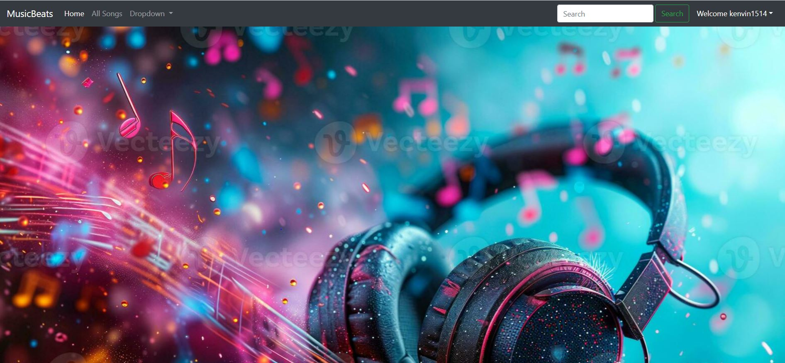

Chào mừng bạn đến với MusicBeats, một ứng dụng web Django cho phép bạn và người dùng khác tải lên, quản lý, và thưởng thức âm nhạc yêu thích của mình. Với MusicBeats, bạn có thể tạo kênh cá nhân, khám phá các bài hát mới, quản lý danh sách nghe sau, và đánh dấu bài hát yêu thích.

## ✨ Tính năng nổi bật

*   **Đăng ký & Đăng nhập:** Quản lý tài khoản người dùng an toàn.
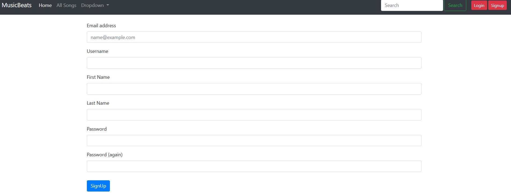

*   **Tải lên âm nhạc:** Người dùng đã đăng nhập có thể tải lên các bài hát của riêng họ.
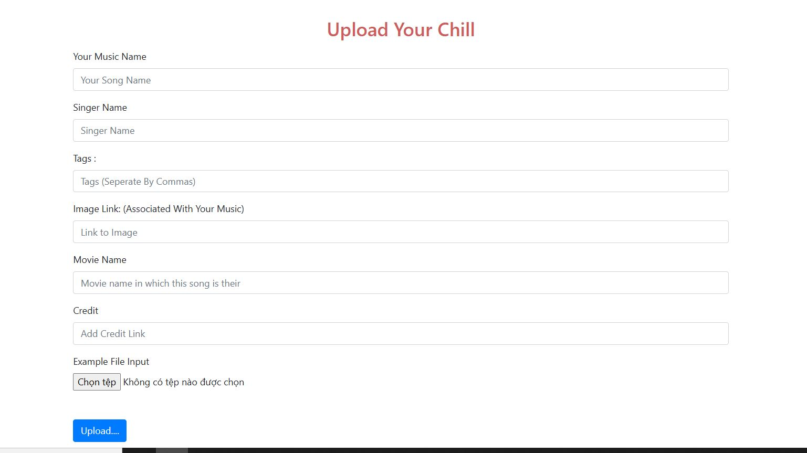

*   **Stream nhạc trực tuyến:** Nghe nhạc mượt mà ngay trên trình duyệt.
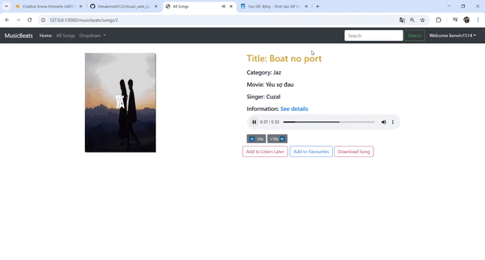

*   **Tìm kiếm thông minh:** Dễ dàng tìm kiếm bài hát theo tên, ca sĩ, hoặc tags.
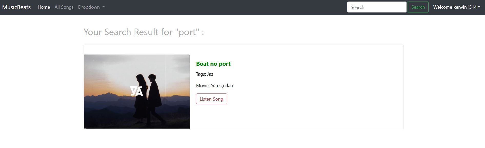

*   **Kênh cá nhân:** Mỗi người dùng có một trang kênh riêng để hiển thị các bài hát đã tải lên.
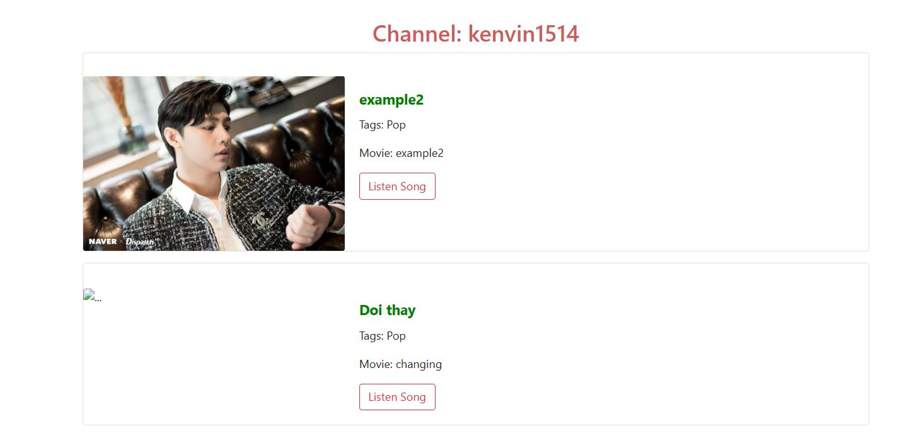

*   **Nghe sau (Listen Later):** Thêm bài hát vào danh sách để thưởng thức sau.
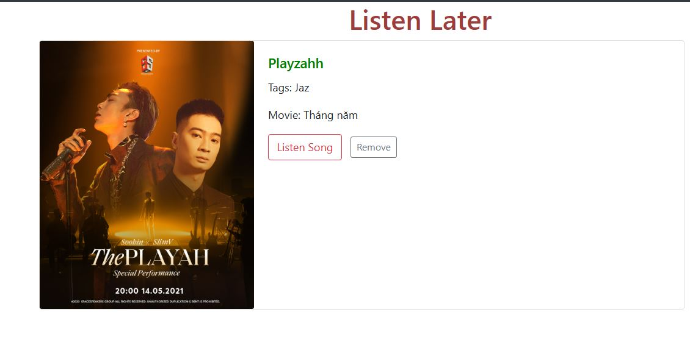
*   **Bài hát yêu thích:** Lưu trữ những bài hát bạn yêu thích nhất.
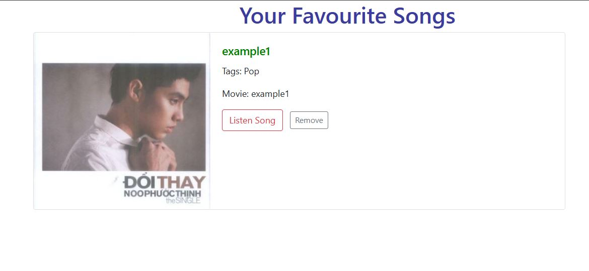
*   **Lịch sử nghe nhạc:** Xem lại các bài hát bạn đã nghe.
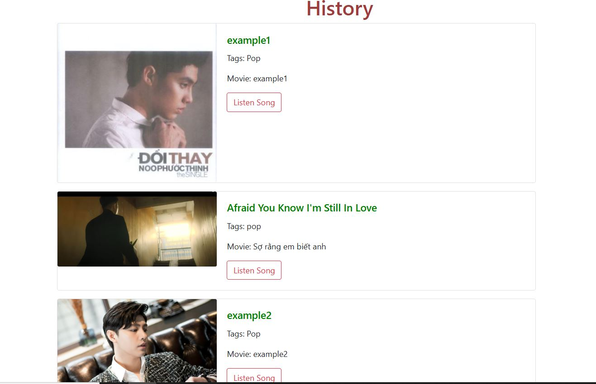
*   **Thông tin chi tiết bài hát:** Xem thông tin về ca sĩ, tags, phim (nếu có), và mô tả.
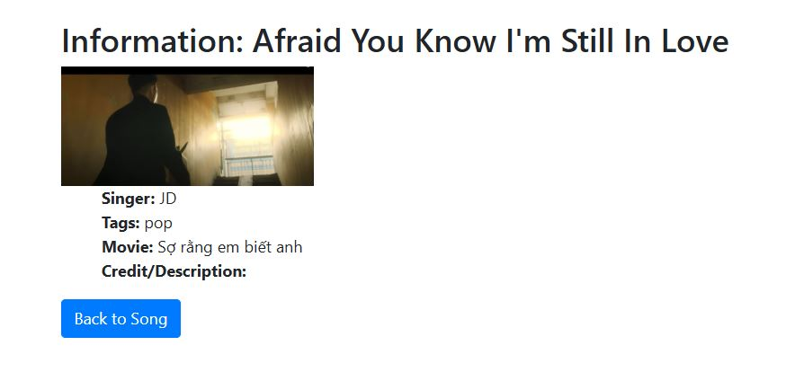
*   **Tải xuống bài hát:** Người dùng có thể tải trực tiếp bài hát về máy.
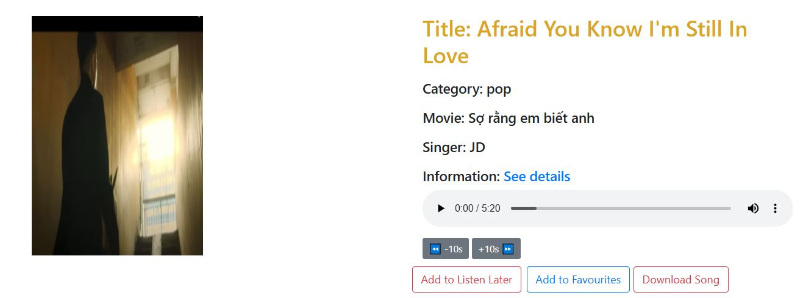
*   **Giao diện người dùng thân thiện:** Được xây dựng với Bootstrap 4 để mang lại trải nghiệm người dùng tốt nhất.
*   **Thông báo tương tác:** Sử dụng SweetAlert2 cho các thông báo và xác nhận thân thiện.

## 🚀 Công nghệ sử dụng

*   **Backend:**
    *   [Django](https://www.djangoproject.com/) (Phiên bản 5.1.6) - Framework web Python mạnh mẽ.
    *   [SQLite3](https://www.sqlite.org/index.html) - Cơ sở dữ liệu mặc định (có thể thay đổi cho môi trường production).
*   **Frontend:**
    *   HTML5, CSS3, JavaScript
    *   [Bootstrap 4](https://getbootstrap.com/docs/4.6/getting-started/introduction/) - Khung CSS phổ biến cho giao diện đáp ứng.
    *   [jQuery](https://jquery.com/) - Thư viện JavaScript.
    *   [SweetAlert2](https://sweetalert2.github.io/) - Thư viện JavaScript cho các hộp thoại tương tác.

## 📦 Cấu trúc thư mục

Dự án được tổ chức theo cấu trúc tiêu chuẩn của Django với một ứng dụng chính (`musicbeats`) và các cấu hình toàn cục (`music`).
